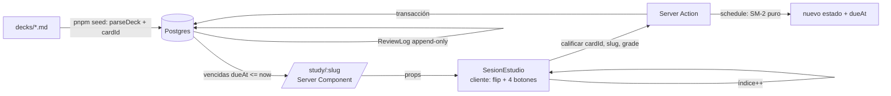

# 📖 DESARROLLO.md — cómo está hecha Mnemo y por qué

**Complemento de `CONTEXTO.md`**: ese resume *qué se decidió*; este explica *cómo está implementado*, archivo por archivo, para que puedas recorrer el código y defenderlo (sirve también como material de entrevista: "explicame tu proyecto").

---

## 1. La idea en una frase

App de tarjetas de estudio (estilo Anki/Quizlet) donde **el contenido vive en archivos Markdown** que editás a mano, y **el estado de repaso vive en Postgres**. El algoritmo SM-2 decide cuándo volvés a ver cada tarjeta.

## 2. Mapa del monorepo — quién depende de quién

```
mnemo/
├─ decks/                # FUENTE DE VERDAD del contenido (.md, versionable con git)
├─ packages/
│  ├─ domain/            # @mnemo/domain — TS PURO. Sin framework, sin DB, sin Node APIs.
│  └─ db/                # @mnemo/db — schema Prisma + cliente singleton
├─ apps/
│  └─ web/               # @mnemo/web — Next.js 15 (la única capa que "se ve")
└─ scripts/
   └─ seed-decks.ts      # sincroniza decks/*.md → Postgres
```

```
@mnemo/domain  ←——  @mnemo/db  ←——  @mnemo/web
 (puro, testeable)    (persistencia)    (UI + server actions)
        ↑_________________________________________|
              (web también usa el dominio directamente)
```

La regla: **las dependencias apuntan hacia el dominio** (misma idea que DDD/hexagonal). El dominio no sabe que existe Prisma, Next ni Postgres — por eso sus 28 tests corren sin BD en milisegundos. Si mañana querés una app móvil con Capacitor, `@mnemo/domain` viaja intacto.

## 3. La decisión central: contenido ≠ estado

| | Contenido (mazos, tarjetas) | Estado (progreso SRS) |
|---|---|---|
| **Vive en** | `decks/*.md` | Postgres |
| **Quién lo escribe** | Vos (a mano, NotebookLM, VS Code) | La app, al calificar |
| **Mutabilidad** | Editable, versionable con git | Cambia en cada repaso |
| **Si borrás la app** | Sobrevive | Se reconstruye con `pnpm seed` (menos el progreso) |

Regla de oro (grabada en el header de `seed-decks.ts`): **la app lee los `.md`, nunca los reescribe**.

## 4. `@mnemo/domain` — el corazón (6 archivos, ~300 líneas)

### 4.1 El formato de mazo (el contrato)

1 archivo `.md` = 1 mazo. Cada encabezado `##` = 1 tarjeta (título = pregunta, cuerpo = respuesta):

```markdown
---
deck: Laravel — Entrevista
tags: [laravel, php, backend]
fuente: Guía de estudio
---

## ¿Qué es el problema N+1?
Consultar 1 vez la lista + N veces por cada relación.
Se resuelve con eager loading.
```

### 4.2 El parser — `src/parse.ts` + `src/frontmatter.ts`

`parseDeck(markdown) → { meta: {title, tags, source}, cards: [{question, answer}] }`

- Normaliza `\r\n` → `\n` (Windows) **antes** de parsear.
- El frontmatter se parsea con un mini-parser propio (`clave: valor` y `tags: [a, b]`): cero dependencias — el formato es chico a propósito para que sea auditable.
- `extractCards` recorre línea por línea: cada `## ` abre una sección, el resto se acumula como respuesta. La respuesta se conserva **verbatim** (multilínea, listas, código indentado).
- Sin frontmatter, el `# h1` opera como título; sin nada, cae a un título derivado (sin el prefijo `##`).

### 4.3 El id estable — `src/id.ts`

```ts
export function cardId(deckSlug: string, question: string): string {
  return sha256(`${deckSlug}\n${question}`).slice(0, 16);
}
```

**Esta línea define la semántica de edición de todo el sistema:**
- Editás la **respuesta** → mismo hash → misma fila en la BD → **conserva el historial SRS**.
- Editás la **pregunta** → otro hash → tarjeta nueva con estado nuevo; la vieja se borra en el próximo seed.
- Reordenás tarjetas → no pasa nada (el orden no entra al hash).

### 4.4 SHA-256 puro — `src/sha256.ts`

¿Por qué no `node:crypto`? Porque el dominio tiene que correr idéntico en Node (seed, server), browser y un futuro Capacitor, **sin depender del runtime**. Implementación FIPS 180-4 en ~100 líneas, verificada contra los vectores NIST en `tests/id.test.ts`. 16 chars hex = 64 bits: sin colisiones prácticas para una biblioteca personal.

### 4.5 SM-2 — `src/sm2.ts` (el algoritmo de Anki)

4 botones → calidad clásica q: **Otra vez→q2, Difícil→q3, Bien→q4, Fácil→q5**. Umbral de aprobación: q ≥ 3.

```
EF' = EF + (0.1 − (5−q)·(0.08 + (5−q)·0.02))     piso 1.3
Aprobada:  reps++ ; intervalo = 1ª→1d, 2ª→6d, luego round(prev · EF')
Fallada:   reps=0 ; intervalo=1d ; lapses++ ; EF SIN tocar (SM-2 clásico)
dueAt = ahora + intervalo
```

**Ejemplo trabajado** (tarjeta nueva, ease 2.5):

| Repaso | Botón | ease después | intervalo | vence en |
|---|---|---|---|---|
| 1 | Bien (q4) | 2.5 − 0.00 = **2.50** | 1 día | mañana |
| 2 | Bien | 2.50 | 6 días (regla fija 2ª) | en 6 días |
| 3 | Bien | 2.50 | round(6 × 2.5) = **15 días** | en 15 días |
| 4 | Difícil (q3) | 2.5 − 0.14 = **2.36** | round(15 × 2.36) = **35 días** | en 35 días |
| 5 | Otra vez (q2) | **2.36** (intacto) | **1 día**, lapses=1 | mañana |

La intuición: el **ease** es "qué tan fácil te resulta esta tarjeta" (multiplica el intervalo); el **lapse** cuenta cuántas veces la olvidaste. Cada caso de esta tabla está testeado en `tests/sm2.test.ts`.

## 5. `@mnemo/db` — el schema Prisma

Tres modelos (`prisma/schema.prisma`):

- **`Deck`** (`slug` como id): índice derivado del archivo. `title`, `source`, `tags`.
- **`Card`** (`id` = el hash): contenido + **estado SRS** (`ease`, `intervalDays`, `dueAt`, `reps`, `lapses`). Índice `[deckSlug, dueAt]` — la query de "vencidas de este mazo" es un index scan.
- **`ReviewLog`** (append-only): una fila **por cada autoevaluación** con el estado RESULTANTE (`grade`, `intervalDays`, `ease`, `reviewedAt`) y el **PREVIO** (`prevEase`, `prevIntervalDays`, `prevReps`, `prevLapses`, `prevDueAt`). Este par resultado/previo es lo que hace posible **deshacer**: restaurar el card y borrar la fila.

¿Por qué el log si el estado ya está en `Card`? Tres razones: habilita las **stats** (racha, actividad por día — `/stats` lee todo de acá), habilita **deshacer** sin snapshot extra, y es el camino al **sync multi-device** del futuro (log append-only + estado derivado, como hace Anki).

`src/client.ts` es un singleton de `PrismaClient` colgado de `globalThis` (evita abrir un pool por hot-reload en dev).

## 6. El seed — idempotencia en 4 pasos

`scripts/seed-decks.ts`, por cada archivo de `decks/`:

1. `slugify(nombre-de-archivo)` → slug del mazo (colisión de slugs = error explícito).
2. `parseDeck` + `cardId` por tarjeta (pregunta duplicada dentro de un mazo = error, el hash colisionaría).
3. **Upsert** del deck y de cada tarjeta. El `update` del card **solo toca question/answer** — jamás el estado SRS.
4. `deleteMany({ id: { notIn: ids } })` — baja las tarjetas que desaparecieron del `.md` (y los mazos sin archivo).

Verificado en la práctica: segunda corrida imprime `0 nuevas, 0 eliminadas`. Podés correrlo mil veces.

## 7. `@mnemo/web` — cinco rutas y dos server actions

| Ruta | Archivo | Qué hace |
|---|---|---|
| `/` | `src/app/page.tsx` | Dashboard: por mazo, total y **vencidas ahora** (dos `groupBy`) |
| `/decks/[slug]` | `src/app/decks/[slug]/page.tsx` | Detalle del mazo: estudiar / repasar igual / quiz |
| `/study/[slug]` | `src/app/study/[slug]/page.tsx` | Vencidas → `SesionEstudio`. Con `?all=1`: **repaso libre** (todo el mazo, con banner) |
| `/stats` | `src/app/stats/page.tsx` | Racha actual y mejor, barras de 30 días, actividad por mazo (todo de `review_logs`) |
| `/quiz/[slug]` | `src/app/quiz/[slug]/page.tsx` + `QuizSesion` | **Modo práctica**: opción múltiple derivada, cero escrituras a la BD |

Todas `force-dynamic`: los datos cambian con cada repaso, nada de caché de página.

### La sesión (`SesionEstudio`) — re-encolado y deshacer

- **Re-encolado** (estilo Anki): calificar "Otra vez" re-encola la tarjeta al final de la cola (máx. 1 reencolado por tarjeta, flag `reencolada`). El total visible crece ("Tarjeta 2 de 11 (+1 re-encolada)") — correcto: aún te queda trabajo.
- **Resumen final** = la ÚLTIMA calificación por tarjeta original (`Map cardId→grade` sobre el historial de la sesión). Una tarjeta fallada y después aprobada cuenta como aprobada.
- **Deshacer** (`Z` o botón): solo la última acción. La action `deshacerUltima` restaura el estado previo desde `review_logs` y borra la fila, en una transacción. Si lo deshecho fue un "Otra vez", la copia re-encolada sale de la cola.

### El flujo completo de un clic en "Bien"



1. El Server Component consulta las vencidas y se las pasa a `SesionEstudio`.
2. Vos revelás la respuesta (**espacio**) y calificás (**1–4** en el teclado o clic).
3. La server action `calificar` (`src/app/actions.ts`): carga el card → `schedule()` del dominio → **transacción**: `UPDATE card` (estado nuevo) + `INSERT review_log` → devuelve el intervalo.
4. El cliente muestra "Vuelve mañana / en N días" y avanza.

### La lección del bug (por qué no hay `revalidatePath`)

Primera versión: la action llamaba `revalidatePath(...)` para "refrescar" las vistas. **Efecto real**: cada calificación re-renderizaba `/study/[slug]` con la lista de vencidas ya encogida → el índice se corría → **saltaba una tarjeta por calificación**, y al terminar borraba el resumen de sesión.

Fix doble:
- La action **no revalida nada**. Como todas las rutas son `force-dynamic`, cada navegación trae datos frescos de todos modos.
- `SesionEstudio` congela su lista en un snapshot: `const [sesion] = useState(cards)` — los refresh del router no pueden mutarla.

Regla general que deja: **una sesión interactiva es un snapshot; el server no debe re-renderizar debajo del usuario que está interactuando.**

### El modo quiz — extensibilidad hecha carne

`armarQuiz` (`domain/src/quiz.ts`) convierte el mazo en opción múltiple: por cada tarjeta, 3 distractores = respuestas de tarjetas hermanas (dedupeadas, mezcladas) + la correcta, todo pasado por `mezclar` (Fisher-Yates con **rng inyectable** → tests deterministas). La página llama con `Math.random` (cada visita, un quiz distinto); `QuizSesion` mezcla además el ORDEN de preguntas al montar.

Decisión clave: el quiz es **modo práctica** — no llama server actions, no escribe nada. Un quiz auto-calificado no es una autoevaluación honesta (adivinás) y contaminaría el scheduling SM-2. Así el `.md` alimenta DOS modos con la misma fuente y cero duplicación: la promesa de extensibilidad del diseño, cumplida.

### Las stats — el log append-only pagando su lugar

`/stats` no consulta `cards`: todo sale de `review_logs`. La lógica de rachas (`rachaActual`, `mejorRacha`) es **función pura del dominio** (testeada sin BD): recibe un `Set` de días activos y cuenta consecutivos; si hoy no repasaste, la racha sigue viva hasta ayer (no te castiga por estudiar a la noche). La agregación por día es una pasada O(n) en JS sobre `reviewedAt` — Prisma no trunca fechas en `groupby` y a escala personal miles de filas no son nada.


## 8. Cómo correrlo / extenderlo

```bash
pnpm setup     # install + postgres (docker) + migrate + seed
pnpm dev       # http://localhost:3000
pnpm test      # 41 tests del dominio (sin DB)
pnpm seed      # re-sync decks/ → BD (idempotente)
pnpm db:studio # inspeccionar la BD
```

**Agregar un mazo** = crear `decks/lo-que-sea.md` con frontmatter + `## preguntas` → `pnpm seed`. Cero código.

**Un mazo tiene tarjetas que ya vencieron y querás re-estudiar**: son datos, no código — usá `pnpm db:studio` o SQL (`UPDATE cards SET "dueAt" = now() WHERE "deckSlug" = '...'`).

## 9. Invariantes (no romper sin pensar)

1. El dominio **no importa** nada de Node/framework (así se cae la frontera hexagonal).
2. La app **nunca escribe** los `.md`.
3. El seed **jamás toca** el estado SRS en un update (solo crea tarjetas nuevas o borra desaparecidas).
4. El id de tarjeta es **siempre** `hash(deckSlug + "\n" + pregunta)` — cambiar la fórmula divorcia contenido de estado.
5. `calificar` no revalida rutas mid-sesión (ver §7).

## 10. Estado y qué sigue

- ✅ **v0** (2026-08-19): sesión de 15 tarjetas en browser, persistencia auditada en Postgres (36 review_logs con ease/interval/reps/lapses correctos por grade).
- ✅ **v1** (2026-08-24): re-encolado + deshacer (auditado en BD: fila borrada, card restaurado exacto, cadena prev→next correcta) · `/stats` (números verificados contra la BD) · `/quiz` (juego completo, cero escrituras) · dominio 41/41.
- 🔼 Repo público con CI: https://github.com/Fabrizio-Alvarez/mnemo (Actions: vitest + tsc + build + bundle de Workers en cada push; `deploy.yml` deploya a Cloudflare con wrangler-action — 2026-08-25, stack final: Workers free + Neon free + dominio CF Registrar; ver CONTEXTO.md §Deploy).
- 🔜 **v2**: importador NotebookLM → borrador de mazo `.md`.
- Futuro: cloze, Capacitor, multi-idioma.
